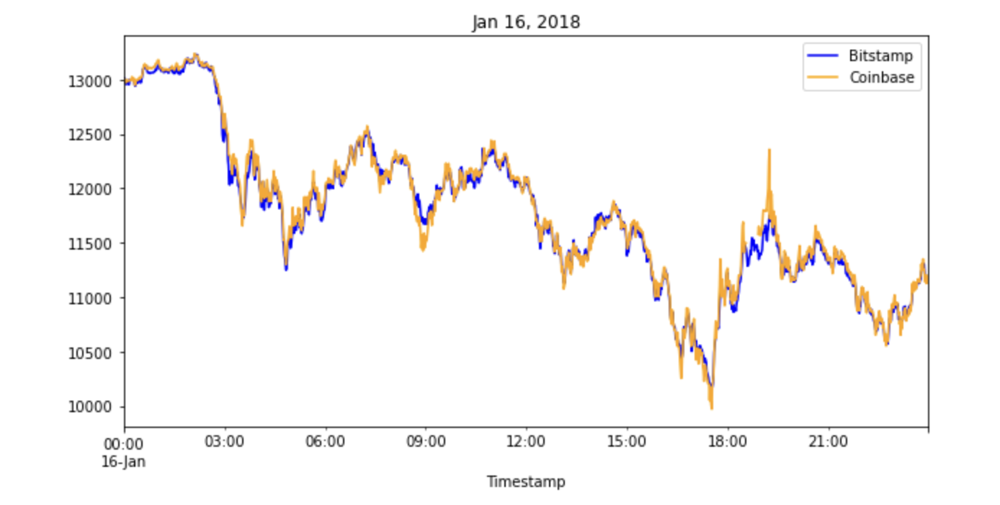
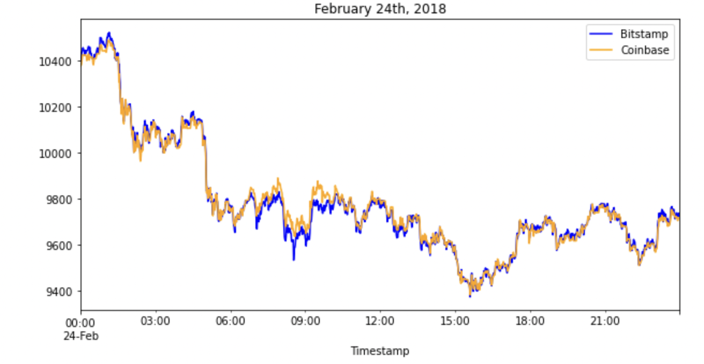
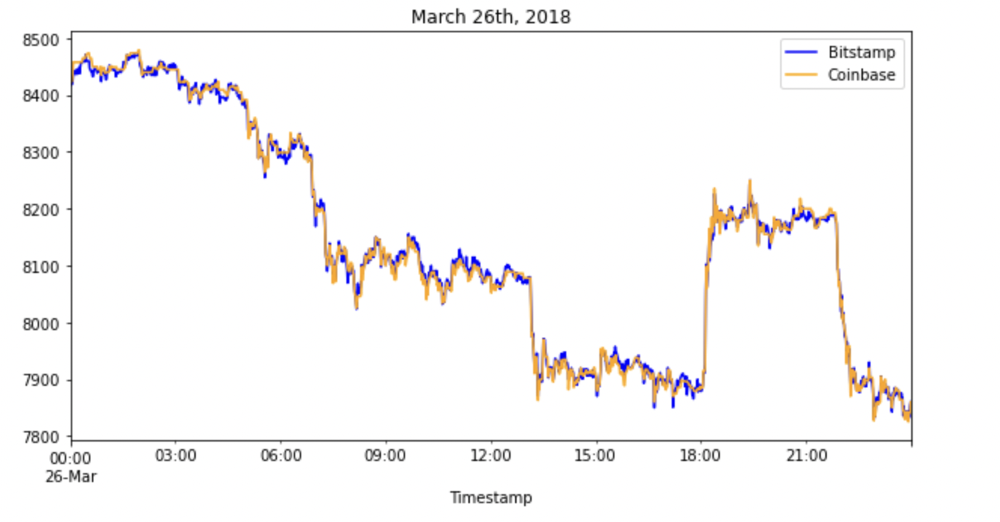

## Crypto Arbitrage

The **crypto_arbitrage** sorts through historical trade data for Bitcoin on two exchanges: Bitstamp and Coinbase. It collects, prepare and analyze the data and determine if any arbitrage opportunities exist for Bitcoin.


---

## Technologies

This project leverages python 3.7.13 with the following packages:

* [pandas](https://pandas.pydata.org/) - For data analysis


---

## Installation Guide

Before running the application first install the pandas dependency in conda dev environment.

```python

    conda create -n dev python=3.7 anaconda

    python -m ipykernel install --user --name dev

    conda activate dev

    conda install pandas

    conda deactivate 
  
```

---


## Usage

To use the loan qualifier application simply clone the repository and run the **crypto_arbitrage.ipynb** with jupyter lab:

```python
    conda activate dev

    jupyter lab

    conda deactivate 
```

Daily plots of bitcoin price between two exchanges in early, middle and late dataset.





---

## Contributors

Kausar Hina

---

## License

MIT
